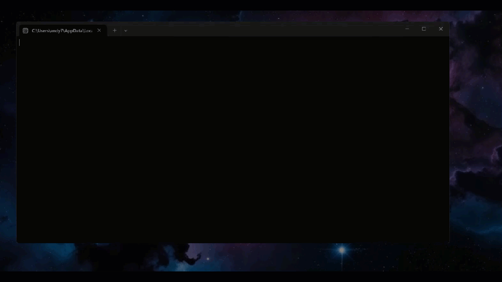

# Excel Reader (.NET Console App)

This project reads a `finances.xlsx` file and converts its data into a model, then prints a list to the console.

## Features

- Reads `finances.xlsx` using a .NET console application
- Maps Excel rows to a C# model
- Prints the list of models to the console



## Getting Started

1. **Clone the repository:**

   ```bash
   git clone https://github.com/andymartinez1/Excel-Reader.git
   ```

2. **Move to the project directory:**

   ```bash
   cd Excel_Reader
   ```

3. **In your IDE, change the working directory to the current directory:**

   ```bash
   Example: "X:/C#/.NET-Console-Apps/Excel-Reader/Excel-Reader/"
   ```

> [!TIP]
> You can right click on the project in your IDE and copy the absolute path

4. **Restore dependencies:**

   ```bash
   dotnet restore
   ```

5. **Update the database:**

   ```bash
   dotnet ef database update
   ```

6. **Run the application:**
   ```bash
   dotnet run
   ```

## Technologies Used

- C#
- Entity Framework
- SQL Server
- Spectre Console
